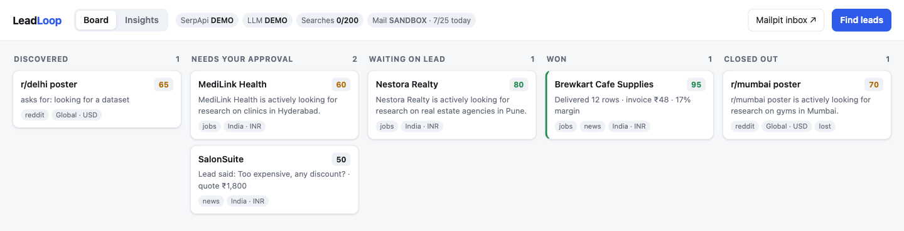
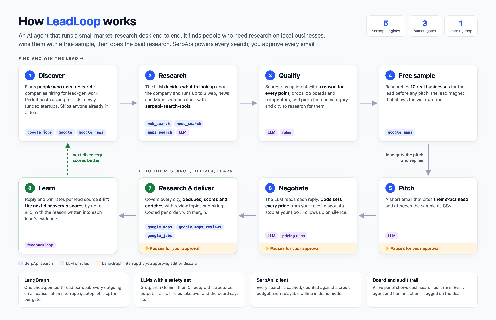
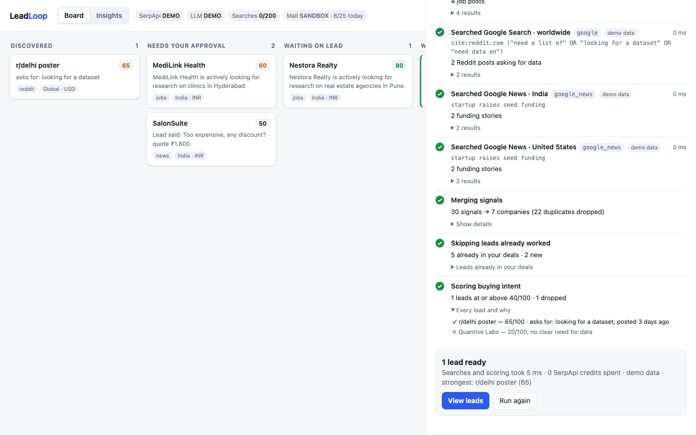
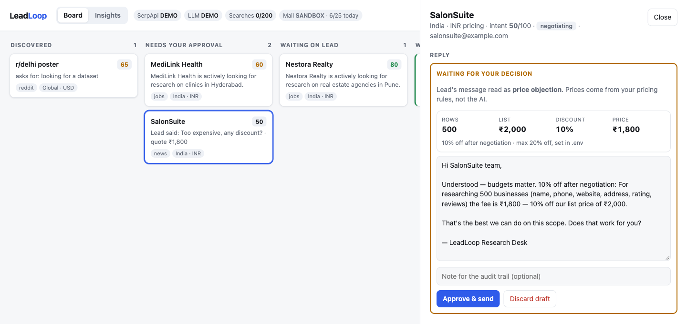
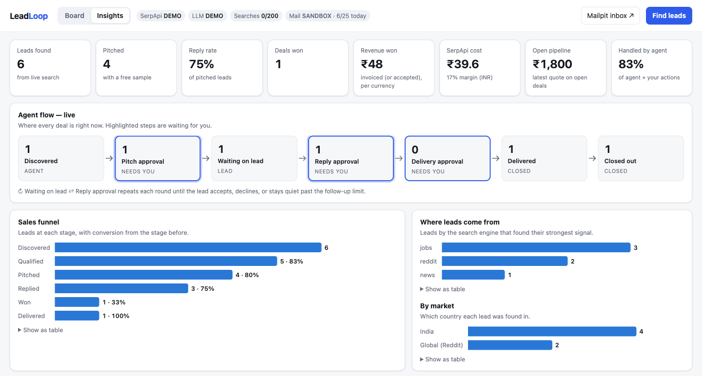

# LeadLoop

[](https://github.com/heyitshubham/LeadLoop/actions/workflows/tests.yml)

An AI agent that runs a small market-research desk end to end. It **finds people who need
research** on local businesses (companies hiring for lead-gen work, people asking on Reddit,
freshly funded startups), **gives each one a free 10-business sample** as a lead magnet, and sells
**your research service**: finding, deduplicating, scoring and enriching every business in their
target market. SerpApi powers every step, and a human can approve, edit or reject any of them.

SerpApi India Hackathon 2026 — track: AI Agents.



## Why it's an agent

- **It plans and searches for itself.** Discovery plans its own searches across markets. Before
  qualifying a lead, the LLM decides what to look up about the company and runs web, news and Maps
  searches through [`serpapi-search-tools`](https://serpapi.github.io/serpapi-search-tools-python/).
- **It compares and decides.** It merges signals for the same company, scores buying intent with a
  reason for every point, drops job boards and competitors, and picks the research that would help most.
- **It acts.** It builds a real sample, writes the pitch, reads replies, negotiates within your
  pricing rules, does the paid research and delivers it.
- **It learns.** Reply and win rates per lead source shift the next discovery's scores.
- **You stay in control.** LangGraph `interrupt()` pauses before every outgoing email, and every
  agent and human action is in the deal's audit trail.

## How it works



## Pipeline

```
discover -> research -> qualify -> build sample -> draft pitch -> [you approve] -> send
                                                                         |
          +-------------------- wait for the lead <----------------------+
          |  reply                         | silence (follow-up due)     ^
          v                                v                             |
     read + price (rules)            draft follow-up                     |
          |                                |                             |
          +-------> [you approve] -> send reply -> won / lost / wait ----+
                                                      |
                     won -> build the order -> [you approve] -> deliver CSV
                                                      |
       reply rates per source feed back into the next discovery's scores
```

| Stage | What happens | SerpApi engine |
|---|---|---|
| Discover | Companies hiring for research / lead-gen / data entry, Reddit posts asking for lists, freshly funded startups. Signals for the same company are merged. Anyone already in a deal (open or closed) is skipped, and discovery searches again once its cached results are older than `LEADLOOP_DISCOVERY_REFRESH_HOURS` (default 24). | `google_jobs`, `google`, `google_news` |
| Score | Deterministic intent score; every point has a reason | — |
| Research | The LLM decides what to look up about the company and runs up to `RESEARCH_MAX_SEARCHES` (default 3) web, news and Maps searches itself, through [`serpapi-search-tools`](https://serpapi.github.io/serpapi-search-tools-python/) as LangGraph tools. Its findings feed the qualify and pitch steps, and the deal shows every search it chose. Groq, Gemini or Claude; skipped for anonymous Reddit posters | `google`, `google_news`, `google_maps` |
| Qualify | The LLM (Groq, Gemini or Claude) reads the evidence and research findings and picks the research that would help most: one business category in one city | — |
| Sample | The lead magnet: a free, real sample of 10 businesses researched for that lead *before* pitching | `google_maps` |
| Pitch | Short email citing their exact need, sample attached as CSV | — |
| Negotiate | The LLM classifies each reply (interested, question, price objection, accept, not now, unsubscribe). **Code sets every price** from your pricing rules; the LLM only words it | — |
| Fulfil | When the lead accepts, the agent does the research: Google Maps pages for the sample's city, then the market's other big cities, until the row count is met. Rows are deduplicated by place id, scored for completeness, and the top rows are enriched with what customers mention in reviews and whether the business is hiring. Every search is costed, including the research and sample that won the deal, so each order shows its SerpApi cost and margin. Short orders are invoiced pro-rata, never padded | `google_maps`, `google_maps_reviews`, `google_jobs` |
| Learn | Reply and win rates per lead source (jobs, Reddit, news) move the intent scores of that source's next leads by up to ±10, with the reason in the lead's evidence | — |
| Follow up | Drafted automatically after `FOLLOWUP_AFTER_DAYS` of silence, up to `MAX_FOLLOWUPS` | — |
| Gates | LangGraph `interrupt()` pauses before every outgoing email until you approve, edit or discard it. Autopilot can skip the pitch, reply or delivery gate | — |

### LLM providers

Set any of `GROQ_API_KEY` (free: 1,000 requests/day per model at console.groq.com),
`GEMINI_API_KEY` or `ANTHROPIC_API_KEY`. They're tried in that order, each with a backup model;
if all fail (quota, outage) the agent falls back to rules and the live panel says so.
Groq uses strict structured output, so every answer matches its Pydantic schema.

### Pricing rules

The fee is for the research work, priced per business researched. Set in `.env`. Defaults:
₹4 per business, ₹1,500 minimum, 500 businesses if the lead doesn't say.
Each price objection takes `DISCOUNT_STEP_PCT` off, down to `MAX_DISCOUNT_PCT`. After that the
agent offers a smaller scope at the same rate instead of going lower. Accepting never re-prices.

### Fulfilment and unit economics

`FULFIL_MAX_SEARCHES` (default 50) caps what one order may spend; `FULFIL_ENRICH_ROWS` (default 10)
sets how many top rows get review topics and a hiring check (2 searches each). Cost uses
`SERP_COST_PER_SEARCH_USD` (default $0.015, the Developer plan's $75 per 5,000 searches), so the
board shows a margin per order. Worked example at the defaults: 500 rows need at least 25 Maps
pages, plus 20 enrichment searches, so 45 searches, plus up to 4 spent before the sale (research
and the sample). At $0.015 each that's about ₹65 against a ₹2,000 invoice (500 businesses × ₹4). Bigger orders need a higher `FULFIL_MAX_SEARCHES`.

The full CSV is saved in `backend/data/datasets/` and attached to the delivery email. The deal
state keeps only a 10-row preview and the report.

## Board and Insights

`http://localhost:8000` has two views:

- **Find leads** opens a live panel showing the agent's work as it happens (streamed from
  `GET /api/discover/stream`): the search plan, each SerpApi search with its engine, query, result
  count, timing and whether it was live (1 credit) or cached (free), how signals were merged, and
  every lead kept or dropped with the reason.

  

- **Board**: deals as cards in five columns (Discovered, Needs your approval, Waiting on lead,
  Won, Closed out). Click a card for the evidence, sample, conversation, quote and audit trail.

  

- **Insights**: KPI tiles (including SerpApi cost and margin), unit economics per order, what the
  agent learned per lead source, a live agent-flow diagram (where every deal is, which steps need you),
  sales funnel, lead sources, negotiation chart (quoted price per round), intent-score
  histogram, who did the work (agent / you / leads), and recent activity. All numbers come from
  `GET /api/stats`; every chart has hover details and a table view.

  

## Run

```bash
docker compose up -d                      # Mailpit inbox at http://localhost:8025
cd backend
python3 -m venv .venv && .venv/bin/pip install -r requirements.txt
cp .env.example .env                      # add keys, or leave empty for DEMO mode
.venv/bin/uvicorn app.main:app --reload   # board: http://localhost:8000  ·  API docs: /docs
.venv/bin/python -m pytest -q
```

Without keys everything runs on `backend/fixtures/` (fictional demo data) and template text.
With keys, every live SerpApi response is cached in `backend/data/serp_cache/` and a ledger
stops live calls at `LEADLOOP_CREDIT_BUDGET`.

## Sending real email

Any SMTP account works. The setup we use (free): **Brevo** sends, replies land in the Zoho
inbox of the From address, and you paste them onto the board.

1. Create a free Brevo account. Under **Senders, Domains & Dedicated IPs → Domains**, add
   your domain (e.g. `yourdomain.com`) and add the DNS records it shows (Brevo code, DKIM, DMARC) at your domain registrar.
2. Under **SMTP & API → SMTP**, generate an SMTP key. Note the **Login** shown there.
3. In `backend/.env`: `SMTP_USER=<that login>`, `SMTP_PASSWORD=<SMTP key>`, `LEADLOOP_SEND_MODE=live`.
4. Restart, then open `/api/mail/check`. It logs in without sending anything.
5. Every deal now needs the lead's email. When they reply, paste it into the deal on the board.

Rehearse with your own second address as the "lead" first.

With a paid Zoho plan (IMAP enabled), set `IMAP_HOST=imappro.zoho.in` plus `IMAP_USER` /
`IMAP_PASSWORD`, and replies are read automatically every minute instead.

## API

| Method | Path | |
|---|---|---|
| GET | `/api/health` | modes, credits, sends today, pricing |
| GET | `/api/mail/check` | test SMTP (and IMAP, if set) login |
| POST | `/api/discover` | find and score leads |
| GET | `/api/leads` | ranked leads with evidence |
| POST | `/api/leads/{id}/deal` | `{"email"?, "autopilot"?: ["pitch", "reply", "delivery"]}` |
| GET | `/api/deals`, `/api/deals/{id}` | state, conversation, quote, audit trail, `pending_gate` |
| POST | `/api/deals/{id}/decision` | `{"action": "approve" \| "edit" \| "reject", "draft"?, "note"?}` |
| POST | `/api/deals/{id}/simulate-reply` | record the lead's reply: role-play in sandbox, or paste it when there's no IMAP |
| POST | `/api/deals/{id}/nudge` | draft the next follow-up now |
| POST | `/api/inbox/poll` | read replies now (IMAP only) |
| GET | `/api/deals/{id}/sample.csv` | the sample dataset |
| GET | `/api/deals/{id}/dataset.csv` | the full dataset built for a won deal |

## Demo video

A 3-minute walkthrough of the agent running locally: _link coming with the submission._

## Guardrails

- Sandbox mode (default) sends everything to Mailpit. Live mode has a daily send cap, an opt-out
  line on every email, and a suppression list: anyone who replies "stop" is never emailed again.
- The LLM is told exactly what the product is and may not claim more (no "hand-verified", no
  emails or owner names, no prices it wasn't given).
- No social-network logins or scraping: discovery uses public search results via SerpApi only.
- Every agent and human action is written to the deal's audit trail.
- Invoices are computed in code: a lead is never charged for rows that weren't delivered.

## Responsible outreach

LeadLoop sends unsolicited email, so it is built to send little of it, and only to people with a
visible need:

- It only pitches leads with public evidence of wanting data (a job post for lead-gen work, a
  Reddit post asking for a list, fresh funding), and every pitch cites that evidence.
- A human approves every email by default. Autopilot is opt-in, per deal and per gate.
- Live mode has a daily send cap (`LEADLOOP_DAILY_SEND_CAP`, default 25), an opt-out line on every
  email, and a suppression list: "stop" ends all contact with that address.
- At most `MAX_FOLLOWUPS` (default 2) follow-ups, then the deal closes on its own.
- The research holds business listings (name, address, public phone, website, ratings), never
  personal data about individuals.

Check the anti-spam law where your leads are (for example CAN-SPAM in the US, the IT Act and
DPDP Act in India) before switching to live mode.

### What LeadLoop sells

LeadLoop sells research work, not search data. It never resells SerpApi access or raw search
responses. What the client pays for is the research: finding the businesses in their target market
across many searches, deduplicating them, scoring each one, and summarising review topics and hiring
signals for the best ones. The 10-business sample is free, as a lead magnet. Check the terms of the
data sources you use (SerpApi, Google Maps) before you run it live.

## License

MIT, see [LICENSE](LICENSE).
